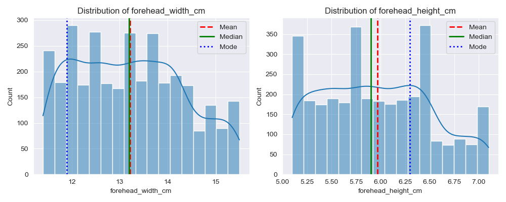
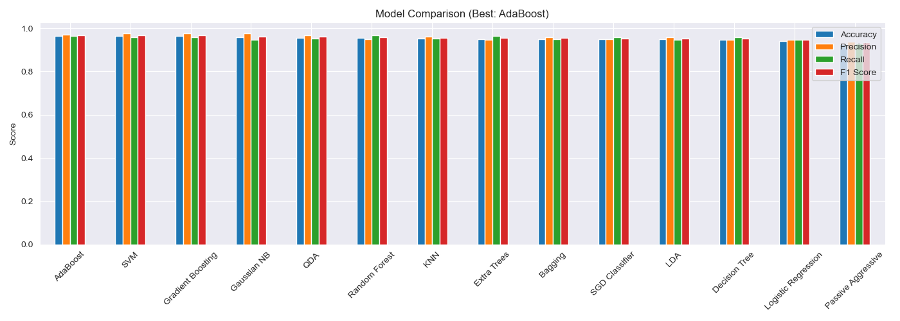
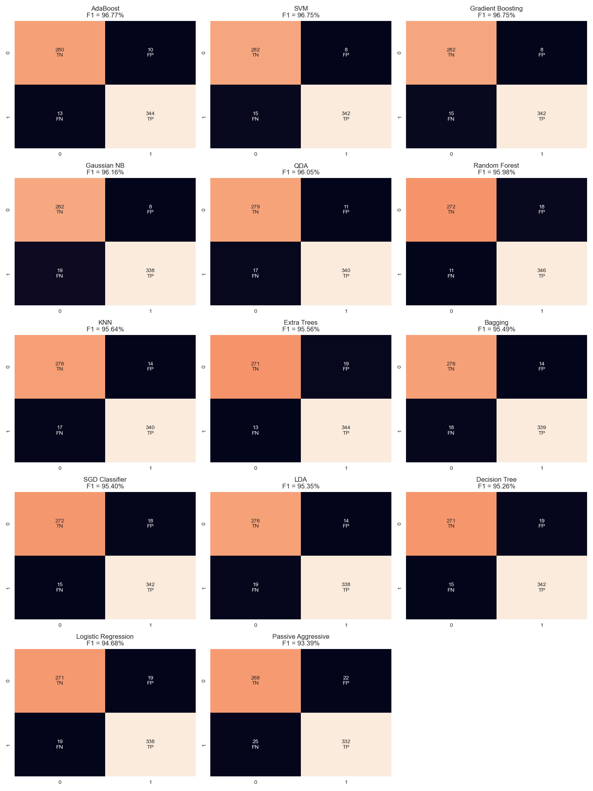

<!DOCTYPE html>
<html lang="en">
<head>
    <meta charset="UTF-8">
</head>
<body>
    <header>
        <h1>Gender Classification Using Facial Features</h1>
        

            <strong>Prepared by:</strong> Debashis Ray 
            <strong>Date:</strong> 31 December 2025 
            <strong>Project Type:</strong> Supervised Machine Learning Classification
        

        

    </header>
    <main>
        <h2>1. Executive Summary</h2>
        

            This report presents the results of a machine learning project designed to
            classify gender using structured facial measurements. Multiple classification
            algorithms were evaluated to determine the most accurate and reliable model.
        

        

            Among all evaluated models, AdaBoost achieved the highest overall performance
            with an F1-score of 96.77%. The results demonstrate that facial geometry features
            provide strong predictive capability for gender classification and can be used
            in real-world applications.
        

        <h2>2. Problem Statement</h2>
        

            The objective of this project is to predict gender as a binary outcome using
            measurable facial attributes. Accurate gender classification supports biometric
            systems, automated identity analysis, and demographic data processing.
        

        <h2>3. Dataset Overview</h2>
        

            The dataset consists of numerical and binary facial feature measurements
            collected from multiple individuals. The dataset is suitable for supervised
            classification tasks.
        

        <h3>3.1 Features</h3>
        <ul type="square">
            <li>Long hair</li>
            <li>Forehead width (cm)</li>
            <li>Forehead height (cm)</li>
            <li>Nose width</li>
            <li>Nose length</li>
            <li>Lip thickness</li>
            <li>Distance between nose and upper lip</li>
        </ul>
        <h3>3.2 Target Variable</h3>
        
Gender (binary classification):

        <ul>
            <li>0 = Female</li>
            <li>1 = Male</li>
        </ul>
        <h2>4. Exploratory Data Analysis</h2>
        <h3>4.1 Distribution Analysis</h3>
        

            Distribution analysis of numeric features such as forehead width and height
            indicates stable distributions with minimal skewness. Mean, median, and mode
            values are closely aligned, suggesting reliable data quality.
        

         
         
         
        <h3>4.2 Correlation Analysis</h3>
        

            Correlation analysis shows that nose-related features and facial distance
            measurements have strong relationships with the target variable. Hair length
            exhibits minimal correlation and limited predictive importance.
        

        
        <h3>4.3 Feature Interaction</h3>
        

            Pairwise feature analysis reveals visible separation patterns between gender
            classes for several feature combinations. These observations support the use
            of non-linear and ensemble-based models.
        

        <h2>5. Modeling Approach</h2>
        

            Multiple classification algorithms were trained and evaluated using consistent
            train-test splits. Model performance was assessed using accuracy, precision,
            recall, and F1-score, with emphasis on balanced performance.
        

        <ul type="square">
            <li>Logistic Regression</li>
            <li>Decision Trees</li>
            <li>Random Forest</li>
            <li>Extra Trees</li>
            <li>Support Vector Machines(SVM)</li>
            <li>K-Nearest Neighbors(KNN)</li>
            <li>Gaussian Naive Bayes</li>
            <li>Gradient Boosting</li>
            <li>AdaBoost</li>
            <li>Bagging</li>
            <li>Stochastic Gradient Descent Classifier (SGD)</li>
            <li>Passive-Aggressive Classifier</li>
            <li>Linear Discriminant Analysis (LDA)</li>
            <li>Quadratic Discriminant Analysis (QDA)</li>
        </ul>
        <h2>6. Model Performance Summary</h2>
        <table cellpadding="20" cellspacing="0">
            <tr>
                <td valign="top">
                    <h2>Model Performance Summary (F1 Score)</h2>
                    <table border="1" cellpadding="6" cellspacing="0">
                        <tr>
                            <th>Model</th>
                            <th>Accuracy</th>
                            <th>Precision</th>
                            <th>Recall</th>
                            <th>F1 Score</th>
                        </tr>
                        <tr bgcolor="lightgreen"><td>AdaBoost</td><td>96.45</td><td>97.18</td><td>96.36</td><td bgcolor="orrenge">96.77</td></tr>
                        <tr><td>SVM</td><td>96.45</td><td>97.71</td><td>95.80</td><td>96.75</td></tr>
                        <tr><td>Gradient Boosting</td><td>96.45</td><td>97.71</td><td>95.80</td><td>96.75</td></tr>
                        <tr><td>Gaussian NB</td><td>95.83</td><td>97.69</td><td>94.68</td><td>96.16</td></tr>
                        <tr><td>QDA</td><td>95.67</td><td>96.87</td><td>95.24</td><td>96.05</td></tr>
                        <tr><td>Random Forest</td><td>95.52</td><td>95.05</td><td>96.92</td><td>95.98</td></tr>
                        <tr><td>KNN</td><td>95.21</td><td>96.05</td><td>95.24</td><td>95.64</td></tr>
                        <tr><td>Extra Trees</td><td>95.05</td><td>94.77</td><td>96.36</td><td>95.56</td></tr>
                        <tr><td>Bagging</td><td>95.05</td><td>96.03</td><td>94.96</td><td>95.49</td></tr>
                        <tr><td>SGD Classifier</td><td>94.90</td><td>95.00</td><td>95.80</td><td>95.40</td></tr>
                        <tr><td>LDA</td><td>94.90</td><td>96.02</td><td>94.68</td><td>95.35</td></tr>
                        <tr><td>Decision Tree</td><td>94.74</td><td>94.74</td><td>95.80</td><td>95.26</td></tr>
                        <tr><td>Logistic Regression</td><td>94.13</td><td>94.68</td><td>94.68</td><td>94.68</td></tr>
                        <tr><td>Passive Aggressive</td><td>92.74</td><td>93.79</td><td>93.00</td><td>93.39</td></tr>
                    </table>
                </td>
                <td valign="top">
                    <h2>Error Breakdown (Sorted by FN)</h2>
                    <table border="1" cellpadding="6" cellspacing="0">
                        <tr>
                            <th>Model</th>
                            <th>TN</th>
                            <th>FP</th>
                            <th>FN</th>
                            <th>TP</th>
                        </tr>
                        <tr><td>Random Forest</td><td>272</td><td>18</td><td>11</td><td>346</td></tr>
                        <tr><td>Extra Trees</td><td>271</td><td>19</td><td>13</td><td>344</td></tr>
                        <tr bgcolor="lightgreen"><td>AdaBoost</td><td>280</td><td>10</td><td>13</td><td>344</td></tr>
                        <tr><td>SGD Classifier</td><td>272</td><td>18</td><td>15</td><td>342</td></tr>
                        <tr><td>SVM</td><td>282</td><td>8</td><td>15</td><td>342</td></tr>
                        <tr><td>Decision Tree</td><td>271</td><td>19</td><td>15</td><td>342</td></tr>
                        <tr><td>Gradient Boosting</td><td>282</td><td>8</td><td>15</td><td>342</td></tr>
                        <tr><td>QDA</td><td>279</td><td>11</td><td>17</td><td>340</td></tr>
                        <tr><td>KNN</td><td>276</td><td>14</td><td>17</td><td>340</td></tr>
                        <tr><td>Bagging</td><td>276</td><td>14</td><td>18</td><td>339</td></tr>
                        <tr><td>Logistic Regression</td><td>271</td><td>19</td><td>19</td><td>338</td></tr>
                        <tr><td>LDA</td><td>276</td><td>14</td><td>19</td><td>338</td></tr>
                        <tr><td>Gaussian NB</td><td>282</td><td>8</td><td>19</td><td>338</td></tr>
                        <tr><td>Passive Aggressive</td><td>268</td><td>22</td><td>25</td><td>332</td></tr>
                    </table>
                </td>
            </tr>
        </table>
        
        <h2>7. Confusion Matrix Analysis</h2>
        

            The confusion matrix of the AdaBoost model shows a high number of correct
            classifications with very few false positives and false negatives, indicating
            strong generalization performance.
        

        
        <h2>8. Key Insights</h2>
        <ul>
            <li>Facial geometry features are strong predictors of gender</li>
            <li>Ensemble models outperform individual classifiers</li>
            <li>Minimal feature engineering was required</li>
            <li>High data quality contributed to strong model performance</li>
        </ul>
        <h2>9. Business Recommendations</h2>
        <ul>
            <li>Deploy AdaBoost as the production model</li>
            <li>Focus on facial measurement features in future data collection</li>
            <li>Deprioritize hairstyle-based features</li>
            <li>Integrate the model into biometric or analytical systems</li>
        </ul>
        <h2>10. Limitations</h2>
        

            Model performance may vary across different populations and datasets. The
            analysis is limited to structured numerical features and does not include
            image-based facial representations.
        

        <h2>11. Conclusion</h2>
        

            This study demonstrates that machine learning can accurately classify gender
            using facial measurements. The AdaBoost model achieved the highest performance
            and is recommended for real-world deployment.
        

        

    </main>
    <footer>       
        

            <strong>Confidential Client Report</strong> 
            For authorized use only.
        

    </footer>
</body>
</html>
